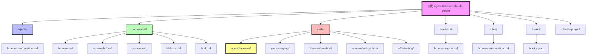

# agent-browser Claude Code Plugin

> 为 Claude Code 提供快速无头浏览器自动化能力的插件 - 基于 Rust CLI 和 Node.js daemon (Playwright)

---

## 变更记录 (Changelog)

### 2026-02-01
- ✅ 完成 agent-browser 核心 skill 实现
- ✅ 添加语义定位器支持（role/label/text）
- ✅ 实现 Ref 系统用于元素引用
- ✅ 添加 `--profile` Cookie 持久化
- ✅ 添加 `--headed` 可视化模式
- ✅ 创建 find 语义查找命令
- ✅ 更新现有 skills（web-scraping、form-automation、screenshot-capture、e2e-testing）
- ✅ 更新 CLAUDE.md 文档

### 2026-01-31 23:33:55
- 初始化项目 AI 上下文
- 完成 Phase A: 全仓清点
- 完成 Phase B: 模块优先扫描
- 创建根级 CLAUDE.md 和 .claude/index.json

---

## 项目愿景

为 Claude Code 提供完整的浏览器自动化能力，让 AI 能够：
- 浏览和交互网页
- 提取结构化数据（爬虫）
- 自动填写表单
- 截取页面截图
- 执行端到端测试
- 管理多标签页

该插件通过集成 [agent-browser](https://github.com/ZenoWangzy/agent-browser) 项目实现底层功能，使用 Rust CLI 进行快速命令解析，Node.js daemon 运行 Playwright 进行浏览器操作。

---

## 架构总览

```
agent-browser-claude-plugin/
├── .claude-plugin/          # 插件清单
├── agents/                  # AI 代理定义
├── commands/                # 斜杠命令
├── skills/                  # 工作流技能
├── contexts/                # 上下文提示
├── rules/                   # 自动化规则
├── hooks/                   # 钩子配置
└── examples/                # 使用示例
```

### 技术栈
- **底层工具**: agent-browser (Rust CLI + Node.js daemon)
- **浏览器引擎**: Playwright
- **插件系统**: Claude Code Plugin API (v2.1.0+)

---

## 模块结构图



---

## 模块索引

| 模块 | 路径 | 职责 | 类型 |
|------|------|------|------|
| browser-automation | `agents/` | 浏览器自动化专家代理 | Agent |
| browse | `commands/` | 网页导航与交互命令 | Command |
| screenshot | `commands/` | 截图捕获命令 | Command |
| scrape | `commands/` | 数据爬取命令 | Command |
| fill-form | `commands/` | 表单自动填充命令 | Command |
| find | `commands/` | 语义查找命令 | Command |
| agent-browser | `skills/` | 浏览器自动化核心技能 | Skill |
| web-scraping | `skills/` | 网页爬取工作流 | Skill |
| form-automation | `skills/` | 表单自动化工作流 | Skill |
| screenshot-capture | `skills/` | 截图捕获工作流 | Skill |
| e2e-testing | `skills/` | 端到端测试工作流 | Skill |
| browser-mode | `contexts/` | 浏览器自动化上下文 | Context |
| browser-automation | `rules/` | 浏览器自动化最佳实践规则 | Rule |
| hooks | `hooks/` | 前置/后置钩子配置 | Hook |

---

## 运行与开发

### 前置要求
- **Claude Code CLI**: v2.1.0 或更高版本
- **agent-browser**: 需要单独安装
  ```bash
  cargo install agent-browser
  ```
- **Node.js**: v18 或更高版本

### 启动 agent-browser daemon
```bash
agent-browser daemon
```

### 本地开发
```bash
# 复制组件到 Claude 配置目录
cp -r agents/* ~/.claude/agents/
cp -r skills/* ~/.claude/skills/
cp -r commands/* ~/.claude/commands/
cp -r rules/* ~/.claude/rules/
cp -r hooks/* ~/.claude/hooks/
```

### 插件安装（推荐）
```bash
# 添加市场源
/plugin marketplace add ZenoWangzy/agent-browser-claude-plugin

# 安装插件
/plugin install agent-browser@agent-browser-claude-plugin
```

---

## 测试策略

由于这是一个文档/配置驱动的插件项目，测试主要通过以下方式：

1. **手动测试**: 将组件复制到 `~/.claude/` 目录后在 Claude Code 中实际使用
2. **多网站验证**: 使用不同类型的网站测试选择器和交互
3. **错误处理**: 验证各种失败场景的钩子提示
4. **文档验证**: 确保命令示例的正确性

---

## 编码规范

### Markdown 文件规范
- 使用正确的标题层级
- 包含代码示例
- 添加清晰的描述
- 参考材料使用表格形式

### Agent 定义规范
- 清晰的名称和描述
- 列出可用工具
- 指定推荐模型
- 包含使用示例

### Skill 定义规范
- 开头说明使用场景
- 提供完整工作流
- 包含最佳实践
- 添加错误处理

### Command 定义规范
- 清晰的语法说明
- 实用的示例
- 列出所有选项
- 说明行为细节

---

## AI 使用指引

### 何时使用 browser-automation agent
用户请求以下任务时调用：
- "截取...的屏幕截图"
- "从...爬取数据"
- "填写这个表单"
- "测试这个网站"
- "检查元素是否存在"
- "导航到并点击..."

### 核心命令速查

```bash
# 导航
agent-browser goto <url>
agent-browser goBack
agent-browser goForward

# 元素交互
agent-browser click <selector>
agent-browser fill <selector> <value>
agent-browser select <selector> <value>

# 数据提取
agent-browser getText <selector>
agent-browser getAttribute <selector> <attribute>
agent-browser evaluate <javascript>

# 视觉
agent-browser screenshot [path]
agent-browser pdf [path]

# 等待
agent-browser waitFor <selector>
agent-browser waitForTimeout <ms>
```

### 选择器稳定性原则
优先使用语义化选择器：
- ✅ `.product-card`, `.user-profile`, `#submit-button`
- ❌ `.css-1a2b3c`, `div > div > span`, `:nth-child(3)`

### 等待策略
- ✅ `agent-browser waitFor .load-complete` 然后操作
- ❌ `sleep 5` 然后操作（可能未就绪）

### 可视化操作（Visual Mode）

使用 `--headed` 模式让浏览器可见，便于调试和验证：

```bash
# 调试时推荐：实时查看操作过程
agent-browser --headed goto https://example.com
agent-browser click .button
```

**适用场景**：
- 调试复杂的动态网站
- 验证选择器是否正确
- 观察异步加载过程
- 演示和录制操作

### Cookie 持久化（Session Persistence）

使用 `--profile` 自动保存 cookies 和会话状态：

```bash
# 第一次：登录并保存状态
agent-browser --profile my_session goto https://example.com/login
agent-browser find label="Email" fill "user@example.com"
agent-browser find label="Password" fill "password"
agent-browser click button[type="submit"]

# 后续操作：无需重新登录
agent-browser --profile my_session goto https://example.com/dashboard
agent-browser --profile my_session goto https://example.com/settings
```

**Profile 优势**：
- 登录一次，多个任务共享状态
- 避免重复登录浪费时间
- 不同任务使用不同 profile 隔离状态
- 支持 93% 的上下文窗口节省

### 语义定位器（Semantic Locators）

使用语义化元素定位，提高脚本稳定性：

```bash
# 语义定位器（推荐）
agent-browser find role="button" name="Submit" click
agent-browser find label="Email" fill "user@example.com"
agent-browser find text="Continue" click

# vs 传统 CSS 选择器（易受重构影响）
agent-browser click .submit-btn
agent-browser fill #email-field "user@example.com"
agent-browser click a.continue-link
```

**语义定位器类型**：
- `role="button"` - ARIA 角色
- `label="Email"` - 表单标签
- `text="Continue"` - 文本内容
- `name="Submit"` - 可访问名称

---

## 依赖说明

### 外部依赖
- [agent-browser](https://github.com/ZenoWangzy/agent-browser) - 核心 Rust CLI + Node.js daemon

### Claude Code 版本要求
- 最低版本: 2.1.0

---

## 贡献指南

欢迎贡献！主要贡献方向：

1. **新增技能**: 语言特定模式、框架特定配置、领域知识
2. **新增命令**: 复杂的工作流助手、集成命令
3. **新增代理**: 专业测试代理、数据提取专家、性能监控代理
4. **钩子和规则**: 验证钩子、最佳实践规则、错误恢复模式

详见 [CONTRIBUTING.md](CONTRIBUTING.md)

---

## 相关链接

- **agent-browser**: https://github.com/ZenoWangzy/agent-browser
- **Claude Code 文档**: https://code.claude.com
- **Playwright 文档**: https://playwright.dev
- **问题追踪**: https://github.com/ZenoWangzy/agent-browser-claude-plugin/issues

---

## 许可证

MIT License - 详见 [LICENSE](LICENSE)
